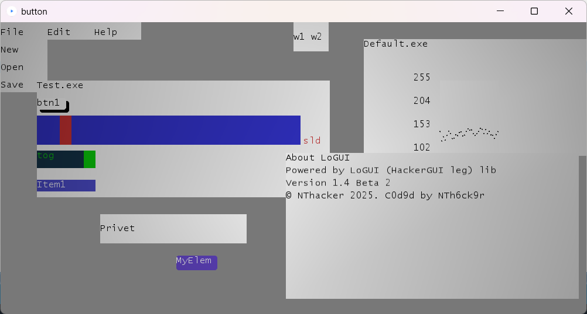

Выберете язык:
<ul>
	<li>Русский (чуть ниже)</li>
	<li><a href="#en">English (tap here)</a></li>
</ul>

<h1>LoGUI 1.3</h1>
<h2>Библиотека Processing для пользовательского интерфейса</b>



<h2>Обновления</h2>
<h3>v1.1</h3> 
<h4>В v1.1 нужно вызывать всегда в draw win_tick(), т.к новый метод обработки нажатий и антидребезга требует вызова win_tick. Иначе элементы работать не будут</h4>

<h3>v1.2</h3>
<h4>Теперь UI адаптивный, автоматическое центрированние под шрифт, нужно в setup после textFont(createFont("Lucida Console", val)), указать _FONT = val, тогда центрированние будет работать, кстати курсор у TextField также настраивается от _FONT</h4>
<h4>Можно уставовить примитивы и цвет, если некогда рисовать спрайты, а также это даёт возможность создания анимаций</h4>

<h3>v1.3</h3>
<h4>Появился плоттер - построитель графиков, также начато создание и интегрированние cstring, планируется добавление HTML constructor и GUI builder</h4>

<h3>v1.4 Beta</h3>
<h4>Новый метод обработки GUI, изменено определение элементов интерефейса, теперь они наследуют класс GUIElem => есть стандарты элементов (они все могут быть в одном массиве, легче тикать и настраивать комплексные элементы интерфейсов), добавлена настройка классов как GUIElem (см. доку). Появились тени, сдвиги, цвета, установки позиций - читайте доку на GUIElem. Добавлены анимации (читайте доку, там будет про это)</h4>

P.S. для освещения и красоты в setup нужно вставить функцию `niceLooks()` и в draw `niceLight()`

<ol>
	<li>Предыстория</li>
	<li>
		Референс
		<ol>
			<li><a href="#g">GUIElem</a></li>
			<li><a href="#anim">Animator (универсальные анимации)</a></li>
			<li><a href="#b">Button</a></li>
			<li><a href="#s">Slider</a></li>
			<li><a href="#t">Toggle</a></li>
			<li><a href="#d">Dropdown</a></li>
			<li><a href="#i">TextField</a></li>
			<li><a href="#p">Plotter</a></li>
			<li><a href="#w">Window</a></li>
			<li><a href="#tb">Tab</a></li>
			<li><a href="#m">MainMenu</a></li>
		</ol>
	</li>
</ol>

<h2>Предыстория</h2>
<p>Библиотека (скорее модуль) появилась абсолютно случайно. Изначально мы делали проект CrispClip c библиотекой интерфейса ControlP5. Мне эта библиотека нравилась - приятные сине-фиолетовые тона, но GiMaker пожаловался мне на низкую кастомизацию ControlP5 и отсутствие нормальных библиотек для интерфейса на Processing. Я сделал с нуля кнопку, и GiMaker'у понравилась возможность помещения картинок в неё. Так или иначе появилась библиотека. В 2-3 строчки кода она позвоялет написать GUI для приложения на Processing и связать его с Arduino Nano, например.</p>

<h2>Референс</h2>

<h3 id="g">GUIElem</h3>
<p>GUIElem - база для всего GUI. Этот элемент интерфеса - прямоугольник с текстом внутри. На его основе строятся все элементы UI.</p>

Референс на класс
```pde
class GUIElem {
  int x, y, w, h;
  int shadsX, shadsY, stX, stY;
  int roundsX, roundsY, roundsW, roundsH;
  int back, txt;
  String text;
  PImage img, bob;

  GUIElem(int px, int py, int pw, int ph, int bcol, int col, String name); // конструктор #1
  GUIElem(int px, int py, int pw, int ph, String name); // конструктор #2 (поменьше, цвет по стандарту белый на фон, чёрный на текст)
  GUIElem(String name); // конструктор #3 (минимализм, 100 на 50, позиция на 0, 0)

  void tick(); // функция отрисовки, вызывается в draw()
  void tickEvent(); // переопределяемая функция для событий
  void tickUI(); // переопределяемая функция для доп. отрисовки и постобработки

  void drawBobishka(float curPos); // отрисовка нового прямоугольника цветом txt

  GUIElem setLocales(int x, int y, int w, int h); // установить общую позицию с длиной и шириной
  GUIElem setLocsRelative(GUIElem rel, int x, int y); // установить относительную позицию
  GUIElem setColor(int bcol, int tcol); // установить цвет
  GUIElem setNameUp(String name); // переименовать
  GUIElem setRounds(int rounds); // скругление везде
  GUIElem setRounds(int rX, int rY, int rW, int rH); // скругление на каждый угол
  GUIElem setImage(PImage img); // установка картинки
  GUIElem setShadows(int px, int py); // hard-тень
  GUIElem shiftText(int px, int py); // сдвинуть текст рядом

  void move(int deltaX, int deltaY); //смещение по осям (для Window)
}

```

Пример использования GUIElem по базе

```pde

GUIElem el;

void setup(){
	size(1000, 500, P2D); // окно побольше
	frameRate(60); // кадриков приятнее
	textFont(createFont("Lucida Console", 16)); // норм шрифт
	el = new GUIElem(25, 25, 100, 50, color(70, 120, 210), color(10, 10, 10), "Hello, world!"); // блок с текстом

	el.setRounds(5) 		// кругляш
		.setShadows(1, 1)	// тени
		.shiftText(5, 5)	// padding
	;
}

void draw(){
	background(120);
	el.tick(); //тикаем
}

```

Если мы создаём кастомный элемент (а такая возможность есть), то нужно создать вот такой класс

```pde

class MyElement extends GUIElem {
	int myParam1, myParam2;

	MyElement(int px, int py, int pw, int ph, int bcol, int col, String name, int mp1, int mp2){
		super(px, py, pw, ph, bcol, col, name); //инит класса
		myParam1 = mp1; //наши параметры
		myParam2 = mp2;
	}

  	MyElement(int px, int py, int pw, int ph, String name, int mp1, int mp2){
		super(px, py, pw, ph, name);
		myParam1 = mp1;
		myParam2 = mp2;
	}
  	
	MyElement(String name, int mp1, int mp2){
		super(name);
		myParam1 = mp1;
		myParam2 = mp2;
	}

	void tickEvent(){
		//проверям условия, делаем что-то
	}

	void tickUI(){
		//рисуем что-нибудь
	}
}

```

<p>Все классы наследуют GUIElem, поэтому первый пример - база, остальное - просто дорисовка</p>

<h3 id="anim">Animator (универсальный)</b>
<p>Animator - класс, содержащий базовые анимации, (специфические анимации, вроде плавного движения слайдера, флажка, дропа и меню, смотреть в референсе классов)</p>
<p>Эти анимации универсальные (смена цвета, исчезновение, возникновение и увеличения (пока несабильно)). Работают так</p>
```pde
Animator anim;
Button btn;

void setup(){
	btn = new Button(50, 130, 50, 30, "test");
	anim = new Animator(btn, COLOR_CHANGE); //GUIElem, type
}

void test(){
	anim.begin(10); //10 кадров на анимацию
}

void draw(){
	background(120);
	btn.tick();
	anim.tick();
}

```

Типы анимаций:
COLOR_SWAP - резкая смена цвета
COLOR_CHANGE - плавная смена цвета
FADE - исчезновение
BRIGHTEN - появление
POPUP - увеличение (нестабильно)
В v1.5 анимаций будет больше

<h3 id="b">Button</h3>
<p>Button - простая кнопка, по нажатию на которую срабатывает событие в функции-обработчике</p>
Простейший код со спрайтами

```pde

Button btn;

void setup(){
	size(1000, 500, P2D); // окно побольше
	frameRate(60); // кадриков приятнее
	textFont(createFont("Lucida Console", 16)); // норм шрифт
	btn = new Button(25, 25, 100, 50, color(70, 120, 210), color(10, 10, 10), "btn1"); // кнопка c обработчиком btn1
	btn.setNameUp("Btn");
}

void btn1(){
	println("Hello, world!"); //клик
}

void draw(){
	background(120);
	win_tick();
	btn.tick(); //тикаем
}

```

Кнопка имеет автоматическую защиту от дребезга. По нажатию в консоли будет сообщение "Clicked!".
Можно добавить другие кнопки, и для них свои обработчики события.

<h3 id="s">Slider</h3>
<p>Slider - слайдер, при перемещении ползунка меняется значение. Можно управлять, например, углом сервомашинки</p>
Простейший код

```pde

Slider sld;
int tmr = 0;

void setup(){
	size(1000, 500, P2D);
	frameRate(60);
	textFont(createFont("Lucida Console", 16));
	
	sld = new Slider(50, 160, 450, 50, color(50, 50, 200), color(200, 50, 50), "sld", -2, 2); //от -2 до 2 
	sld.shiftText(455, 30);
}

void draw(){
	win_tick();
	if(millis() - tmr >= 100){ //таймер с dt = 100
		println(sld.value); //читаем значение
		tmr = millis();
	}
	sld.tick();
}

```

Анимация:
```pde
//где-то в setup()
sld.setAnim(true, 0.65); //true, плавность (1 - резко, 0.001 - супер плавно)
```

<h3 id="t">Toggle</h3>
<p>Toggle - флажок. Имеет значение true и false. Им можно открывать/закрывать транзистор/реле</p>
Простейший код

```pde

Toggle tog;
int tmr = 0;

void setup(){
	size(1000, 500, P2D);
	frameRate(60);
	textFont(createFont("Lucida Console", 16));
	
	tog = new Toggle(50, 220, 100, 30, color(20, 50, 70), color(10, 200, 10), "tog");
}

void draw(){
	win_tick();
	if(millis() - tmr >= 200){ //таймер с dt = 200
		println(tog.value); //читаем значение
		tmr = millis();
	}
	tog.tick();
}

```

Значение tog.value false если флажок опущен и true если поднят.

Анимация:
```pde
//где-то в setup()
tog.setAnim(true, 0.65); //true, плавность (1 - резко, 0.001 - супер плавно)
```

<h3 id="d">Dropdown</h3>
<p>Dropdown - выпадное меню. По нажатию открываются элементы, среди которых можно выбрать нужный параметр</p>
Простейший код

```pde

Dropdown drop;
int tmr = 0;

void setup(){
	size(1000, 500, P2D);
	frameRate(60);
	textFont(createFont("Lucida Console", 16));
	String[] str = {"Item1", "Item2", "Item3"};
	drop = new Dropdown(50, 270, 100, 20, color(75, 75, 200), 255, str, 20);
}

void draw(){
	win_tick();
	if(millis() - tmr >= 500){ //таймер с dt = 500
		
		switch(drop.value){
			case 0:
				println("lol");
				break;
			case 1:
				println("kek");
				break;
			case 2:
				println("4burek");
				break;
		}
		
		tmr = millis();
	}
	drop.tick();
}

Анимация:
```pde
//где-то в setup()
tog.setAnim(true, 0.1); //true, плавность (1 - резко, 0.001 - супер плавно)
```

```

Получив значение drop.value, мы засовываем его в switch. Причём drop.value - индекс на слово в массиве str.

<h3 id="i">TextField</h3>
<p>TextField - текстовое поле. По нажатию можно написать текст, пригодится для чатов, отправки пакетов и прочего</p>
Простейший код

```pde

TextField txt;
int tmr = 0;

void setup(){
	size(1000, 500, P2D);
	frameRate(60);
	textFont(createFont("Lucida Console", 16));
	txt = new TextField(250, 400, 250, 50, "", 20);
}

void draw(){
	win_tick();
	if(millis() - tmr >= 2000){ //таймер с dt = 2000
		println(new String(txt.value));
		tmr = millis();
	}
	txt.tick();
}

```

<p>Появились 2 функции в v1.3 - parseInt и parseFloat, txt.parseInt вернёт число, для txt.parseFloat делиметры запятая, точка</p>

<h3 id="p">Plotter</h3>
<p>Plotter - построитель графиков, очень полезен для чтения сигналов</p>
<p>Здесь будет протокол чтения связи с Arduino nano по serial</p>

```ino

void setup(){
	uart.begin(9600); //в GyverCore uart вместо Serial
}

void loop(){
	static uint32_t tmr = 0; 
	if(millis() - tmr >= 100){
		uart.write(analogRead(4)); //на 19-м пине читаем по ADC
		tmr = millis(); 
	}
}

```

```pde

Plotter plt;
Serial serial;

void setup(){
	frameRate(60);
	textFont(createFont("Lucida Console", 16));
	size(1000, 500, P3D);

	plt = new Plotter(750, 100, 100, 200, 255, 0, "", 34, 5, 0, 1024);
	serial = serial = new Serial(this, "COM4", 9600); //nano на com4
}

void draw(){
	win_tick();

	if(serial.available()){
		plt.value = (float) serial.read();
	}

	plt.tick();
}

```

<h3 id="w">Window</h3>
Вот теперь мы переходим к комплексным элементам интерфейса. Окна - их можно двигать, в них группируются схожие элементы интерфейса. Пример кода:

```pde

Button btn;
Slider sld;
Toggle tog;
Dropdown drop;

Window win;

void setup(){
	frameRate(60);
	textFont(createFont("Lucida Console", 16));	
	size(1000, 500, P3D);
	
	btn = new Button(25, 25, 100, 50, color(70, 120, 210), color(10, 10, 10), "btn1"); // кнопка c обработчиком btn1
	sld = new Slider(50, 160, 450, 50, color(50, 50, 200), color(200, 50, 50), "sld", -2, 2); //от -2 до 2 
	tog = new Toggle(50, 220, 100, 30, color(20, 50, 70), color(10, 200, 10), "tog");
	String[] str = {"Item1", "Item2", "Item3"};
	drop = new Dropdown(50, 270, 100, 20, color(75, 75, 200), 255, str, 20);

	win = new Window(50, 100, 500, 200, 20, "Test.exe");
	win.elems = new GUIElem[4];
	
	win.elems[0] = btn;
	win.elems[1] = sld;
	win.elems[2] = tog;
	win.elems[3] = drop;
}

void btn1(){
	println("Test");
	println(sld.value);
	println(tog.value);
	println(str[drop.value]);
}

void draw(){
	win_tick();
	win.tick();
}

```

Дальше можно двигать окно, и все элементы тоже будут двигаться.

<h3 id="tb">Tab</h3>
Tab - вкладки. Они удобны, когда у нас нет места для окна, а сгруппировать элементы надо.

```pde

Button btn;
Slider sld;
Toggle tog;
Dropdown drop;

Tab tab;

void setup(){
	frameRate(60);
	textFont(createFont("Lucida Console", 16));	
	size(1000, 500, P3D);
	
	btn = new Button(25, 25, 100, 50, color(70, 120, 210), color(10, 10, 10), "btn1"); // кнопка c обработчиком btn1
	sld = new Slider(50, 160, 450, 50, color(50, 50, 200), color(200, 50, 50), "sld", -2, 2); //от -2 до 2 
	tog = new Toggle(50, 220, 100, 30, color(20, 50, 70), color(10, 200, 10), "tog");
	String[] str = {"Item1", "Item2", "Item3"};
	drop = new Dropdown(50, 270, 100, 20, color(75, 75, 200), 255, str, 20);

	String[] st = {"w1", "w2"};
	tab = new Tab(500, 0, 60, 50, st, 30);

	win.elems = new GUIElem[4];
	
	win.elems[0] = btn;
	win.elems[1] = sld;
	win.elems[2] = tog;
	win.elems[3] = drop;
}

void btn1(){
	println("Test");
	println(sld.value);
	println(tog.value);
	println(str[drop.value]);
}

void w1(){
	btn.tick();
	tog.tick();
}

void w2(){
	btn.tick();
	sld.tick();
	drop.tick();
}

void draw(){
	win_tick();
	tab.tick();
}

```

<h3 id="i">MainMenu</h3>
<p>Типичное меню сверху, которое File, Edit, Help и т.д.</p>
<h4>Внимание! MainMenu не наследует параметры GUIElem!</h4>
Простейший код

```pde

MainMenu menu;

void setup(){
	menu = new MainMenu(3);
	String[] fl = {"New", "Open", "Save"};
	String[] ed = {"Copy", "Paste"};
	String[] hp = {"About"};
	menu.addNextMenu(0, "File", fl);
	menu.addNextMenu(1, "Edit", ed);
	menu.addNextMenu(2, "Help", hp);
}

void draw(){
	win_tick();
	menu.tick();
}

void Open() {
  selectInput("test", "selected");
}

void selected(File file) {
  println(file);
}

void Save() {
  println("Maybe saved");
}
void Copy() {
  println("Maybe copied");
}
void Paste() {
  println("Maybe pasted");
}
void New() {
  println("Restarted");
}

void About() {
	println("Powered by HackerGUI (LoGUI) lib");
	println("Version 1.4 Beta 2");
	println("© NThacker 2025. C0d9d by NTh6ck9r");
}

```

Для анимации нужно добавить в конструкторе `menu = new MainMenu(3, 0.1); //2-й параметр плавность`.


A Graphical "Processing" library for interface customization - <b id="en">LoGUI</b>

<ol>
	<li>Description</li>
	<li>
		Reference 
		<ol>
			<li><a href="#be">Button</a></li>
			<li><a href="#se">Slider</a></li>
			<li><a href="#te">Toggle</a></li>
			<li><a href="#de">Dropdown</a></li>
			<li><a href="#we">Window</a></li>
			<li><a href="#tbe">Tab</a></li>
		</ol>
	</li>
</ol>

<h2>Description</h2>
<p>Library (more likely a module) was created due to the complexities during the Developement which resolved to the custom solution - LoGUI
This library helps you create beautiful buttons with cool designs in seconds and used in every possible scenario like for Arduino Nano for example</p>


<h2>Examples</h2>

<h3 id="be">Button</h3>
<p>Button - a simple button, on press calls an event in function</p>
With pictures

```pde
Button btn; //obviously a button
PImage img; //object
void setup(){
	size(1000, 500);
	img = loadImage("test.png");
	btn = new Button(img, 0, 0, 50, 25, "btn"); //button x, y, w, h
}

void btn(){
	println("Clicked!")
}

void draw(){
	background(120);
	win_tick();
	btn.tick(); //initialize the button(no delay)
}
```

With text (+ animation for joke)
```pde
Button btn; ////obviously a button
int tmr = 0; //millis timer
void setup(){
	size(1000, 500);
	btn = new Button(1, 0, 0, 50, 25, "btn"); //button primitive (1 - square), x, y, w, h
	btn.back = color(127, 127, 127);
	btn.text = color(0, 0, 0);
	textFont(createFont("Lucida Console", 16));
	//here _FONT not required, as default here 16, but we're reset it manually
	_FONT = 16;
}

void btn(){
	//animation
	animate = true;
  	btn.text = 255;
  	btn.back = 0;
	tmr = millis();
	//click event
	println("Clicked!");
}

void draw(){
	if(animate, millis() - tmr >= 30){
		btn.back = color(127, 127, 127);
		btn.text = color(0, 0, 0);
		animate = !animate;
		tmr = millis();
	}
	background(120);
	win_tick();
	btn.tick(); //initialize the button(no delay)
}
```


Button automaticaly protected from multi-click
On press it prints in terminal "Clicked!".
You can add other buttons with separate functionalities

<h3 id="se">Slider</h3>
<p>Slider - basic slider, moving knob changes the value. </p>

With sprites

```pde
Slider sld;
int tmr = 0;

void setup(){
	size(1000, 500);
	sld = new Slider(loadImage("sld1.png"), loadImage("sld2.png"), 50, 160, 450, 50, 0, 10); //sld1 - background, sld2 - slider. x, y, w, h, minV, maxV
}

void draw(){
	background(120);
	win_tick();
	sld.tick(); //init slider (no delay)
	if(millis() - tmr >= 10){ //timer based on millis (dt = 10 ms)
		println(sld.value); //return value
		tmr = millis();
	}
}
```

With color

```pde
Slider sld;
int tmr = 0;

void setup(){
	size(1000, 500);
	sld = new Slider(color(50, 50, 200), color(200, 50, 50), 50, 160, 450, 50, 0, 10); //sld1 - фон, sld2 - ползунок. x, y, w, h, minV, maxV
}

void draw(){
	background(120);
	win_tick();
	sld.tick(); ////init slider (no delay)
	if(millis() - tmr >= 10){ //timer based on millis (dt = 10 ms)
		println(sld.value); //return value
		tmr = millis();
	}
}
```

The value returned from sld.value clamped in between minV and maxV.
Timer based on millis controlls the amount of output signals in terminal. Not required

<h3 id="te">Toggle</h3>
<p>Toggle - returns true or false. Helpful for boolean operations and forms</p>

With sprites

```pde
Toggle tog;

void setup(){
	tog = new Toggle(loadImage("tog1.png"), loadImage("tog2.png"), 50, 220, 100, 30); //tog1 - background, tog2 - slider, x, y, w, h 
}

void draw(){
	background(120);
	win_tick();
	tog.tick();
	println(tog.value);
}
```

With color

```pde
Toggle tog;

void setup(){
	tog = new Toggle(color(20, 50, 70), color(10, 200, 10), 50, 220, 100, 30); //background, slider, x, y, w, h 
}

void draw(){
	background(120);
	win_tick();
	tog.tick();
	println(tog.value);
}
```

The Value tog.value returns false if toggle is off and true if on

<h3 id="de">Dropdown</h3>
<p>Dropdown - could be also a list. On click reveals the menu with multiple choices</p>

```pde

Dropdown drop;
int tmr = 0;

void setup(){
	String[] str = {"Item1", "Item2", "Item3"}; //elements
	drop = new Dropdown(str, 50, 270, 100, 20, 20); // elems, x, y, w, h, d - element scale
}

void draw(){
	background(120);
	win_tick();
	drop.tick();
	if(millis() - tmr >= 10){
		switch(drop.value){
			case 0:
				println("lol");
				break;
			case 1:
				println("kek");
				break;
			case 2:
				println("4eburek");
				break;
		}
		tmr = millis;
	}
}
```
We use drop.value inside of switch where drop.value - word index in massive str.

<h3 id="we">Window</h3>
A complex UI element. Windows are translatable and gruped with other elements

```pde
Button btn;
Slider sld;
Toggle tog;
Dropdown drop;
Window win;

void setup() {
	size(1000, 500);
	frameRate(60); //use " " for adaptive framerate
	btn = new Button(loadImage("test.png"), 50, 130, 50, 20, "btn1");
	sld = new Slider(loadImage("sld1.png"), loadImage("sld2.png"), 50, 160, 450, 50, 0, 10);
	tog = new Toggle(loadImage("sld1.png"), loadImage("sld2.png"), 50, 220, 100, 30);
	String[] str = {"Item1", "Item2", "Item3"};
	drop = new Dropdown(str, 50, 270, 100, 20, 20);
	win = new Window("Test.exe", 50, 100, 500, 200, 20); //x, y, w, h, d - header size

	//adding buttons as child objects
	win.btns = new Button[1];
	win.slds = new Slider[1];
	win.togs = new Toggle[1];
	win.drops = new Dropdown[1];

	win.btns[0] = btn;
	win.slds[0] = sld;
	win.togs[0] = tog;
	win.drops[0] = drop;
}

void btn1() {
	println("Test");
}

void draw() {
	background(120);
	win_tick();
	win.tick();
}
```
Child objects now moving with the window

<h3 id="tbe">Tab</h3>
Tab - similar to the switch element. Basically the toggle between Frames
Let's add some tabs to the "window" example

```pde
Button btn;
Slider sld;
Toggle tog;
Dropdown drop;
Window win;
Tab tab;

void setup() {
	size(1000, 500);
	frameRate(60);
	btn = new Button(loadImage("test.png"), 50, 130, 50, 20, "btn1");
	sld = new Slider(loadImage("sld1.png"), loadImage("sld2.png"), 50, 160, 450, 50, 0, 10);
	tog = new Toggle(loadImage("sld1.png"), loadImage("sld2.png"), 50, 220, 100, 30);
	String[] str = {"Item1", "Item2", "Item3"};
	drop = new Dropdown(str, 50, 270, 100, 20, 20);
	win = new Window("Test.exe", 50, 100, 500, 200, 20);

	win.btns = new Button[1];
	win.slds = new Slider[1];
	win.togs = new Toggle[1];
	win.drops = new Dropdown[1];

	win.btns[0] = btn;
	win.slds[0] = sld;
	win.togs[0] = tog;
	win.drops[0] = drop;
	String[] st = {"w1", "w2"};
	tab = new Tab(st, 500, 0, 100, 50, 30); //x, y, w, h, d
}

void btn1() {
	println("Test");
}

void w1() {
	win.tick();
}

void w2() {
	sld.tick();
}

void draw() {
	background(120);
	win_tick();
	tab.tick();
}
```
With the press of "W2" only slider will be shown.
